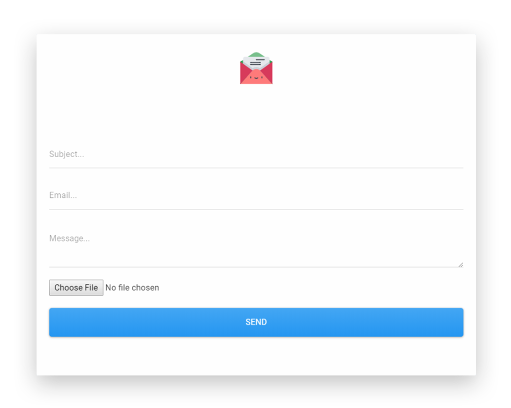

<h1 align="center">Contact Form using PHPMailer</h1>

&nbsp;&nbsp;&nbsp;&nbsp;&nbsp;&nbsp;&nbsp;&nbsp;&nbsp;&nbsp;&nbsp;&nbsp;&nbsp;&nbsp;&nbsp;&nbsp;&nbsp;&nbsp;&nbsp;&nbsp;&nbsp;&nbsp;&nbsp;&nbsp;&nbsp;&nbsp;&nbsp;&nbsp;&nbsp;&nbsp;

---

I created this contact form as the basis to learn about the PHPMailer library and how mail is sent through the SMTP standard protocol in contrast to the php mail().

It has been deployed on Heroku so that you can take it for a spin by clicking on the "Demo" link below. I used Cmdr in combination with heroku's CLI to push the project on a remote heroku branch and it will remain on accessible, as long as I do not run out of my monthly dynos (which is plenty).

Try it out: <h2><a href="https://contact-form-using-phpmailer.herokuapp.com/" target="_blank">DEMO</a></h2>

Tools used:
+ HTML
+ CSS
+ Php
+ Bootstrap
+ PHPMailer
+ Git
+ Sublime
+ Cmder
+ Xampp
+ Heroku

Please let me know any suggestions or corrections you would like me to be aware of.

**Note:** An empty composer was intentionally left in, because heroku has trouble detecting and categorising the app as PHP.
