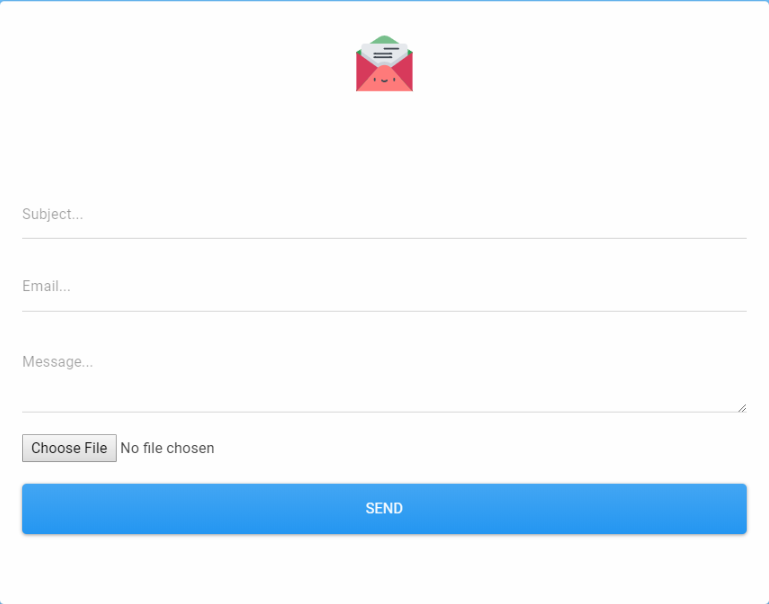

<h1 align="center">Contact_Form_using-_PHPMailer</h1>

---

I created this contact form as the basis to learn about the PHPMailer library and how mail is sent through the SMTP standard protocol in contrast to the php mail().

Try it out: <h2><a href="https://contact-form-using-phpmailer.herokuapp.com/">DEMO</a></h2>

Tools used:
*HTML
*CSS
*Php
*Bootstrap
*PHPMailer
*Git
*Sublime
*Cmder
*Xampp
*Heroku

**Note:** An empty composer was intentionally left in, because heroku has trouble detecting and categorising the app as PHP.